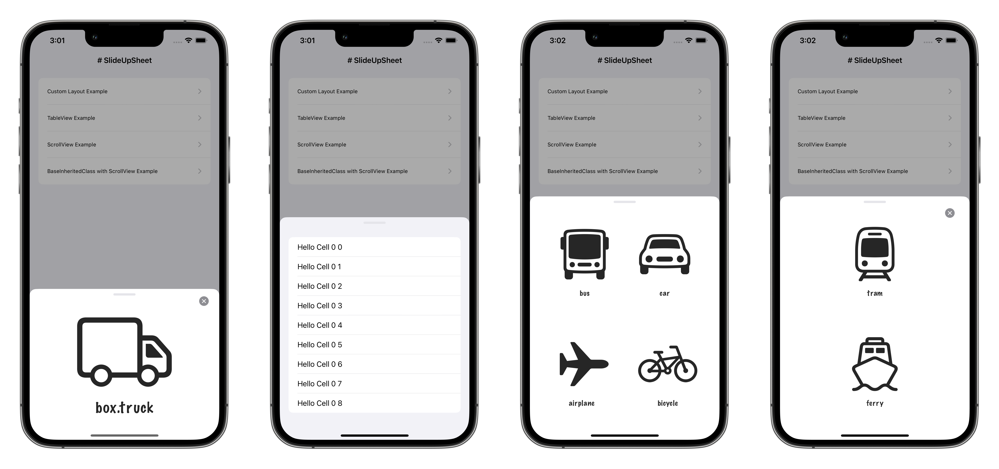

# SlideUpSheet
Custom presentation controller that slides up from the bottom and can be dismissed with a swipe down pan down gesture and has a dynamic dimmed background.



### Installation
SlideUpSheet is currently available either manually by cloning the project and adding the folder `SlideUpSheet` to your project, or you can use the Swift Package Manager (SPM).

- In Xcode, click File > Swift Packages > Add Package Dependency.
- In the dialog that appears, enter the repository URL: https://github.com/iAmrMohamed/SlideUpSheet.git
- In Version, select Up to Next Major and take the default option.
- Click Next and select the library `SlideUpSheet` checkbox, then click Finish and your're all set. 

### Requirements
- Requires iOS 9.0+

### Usage

It's best to check the examples included in the folder iOS Example.

### Storyboards
Select your view controller and choose from the right side panel the identity inspector and set the class to `SlideUpSheetBaseViewController` (if needed set the module to `SlideUpSheet` too).

### Programmatically

#### Setting the presentation controller manually with `UIViewControllerTransitioningDelegate`
```swift
import SlideUpSheet

class ViewController: UIViewController {
    override func viewDidLoad() {
        super.viewDidLoad()
    }
    
    @IBAction func presentViewController(_ sender: UIButton) {
        let dvc = CustomViewController()
        dvc.modalPresentationStyle = .custom
        dvc.transitioningDelegate = self
        present(dvc, animated: true)
    }
}

extension ViewController: UIViewControllerTransitioningDelegate {
    func presentationController(forPresented presented: UIViewController, presenting: UIViewController?, source: UIViewController) -> UIPresentationController? {
        SlideUpSheetPresentationController(presentedViewController: presented, presenting: presenting)
    }
}
```

#### Inheriting the base class `SlideUpSheetBaseViewController`
```swift
import SlideUpSheet

class ViewController: UIViewController {
    override func viewDidLoad() {
        super.viewDidLoad()
        // prevents the swipe down to dismiss
        slideUpSheet.allowsDismissing = false
    }
    
    @IBAction func presentViewController(_ sender: UIButton) {
        let dvc = CustomViewController()
        present(dvc, animated: true)
    }
}

class CustomViewController: SlideUpSheetBaseViewController {
    override func viewDidLoad() {
        super.viewDidLoad()
    }
}
```

#### Using the shared delegate `SlideUpSheetSharedTransitioningDelegate`
```swift
import SlideUpSheet

class ViewController: UIViewController {
    override func viewDidLoad() {
        super.viewDidLoad()
    }
    
    @IBAction func presentViewController(_ sender: UIButton) {
        let dvc = CustomViewController()
        dvc.modalPresentationStyle = .custom
        dvc.transitioningDelegate = SlideUpSheetSharedTransitioningDelegate.sharedDelegate()
        present(dvc, animated: true)
    }
}

class CustomViewController: SlideUpSheetBaseViewController {
    override func viewDidLoad() {
        super.viewDidLoad()
    }
}
```

## Author
[@iAmrMohamed](https://twitter.com/iAmrMohamed)

## License

SlideUpSheet is available under the MIT license. See the LICENSE file for more info.
